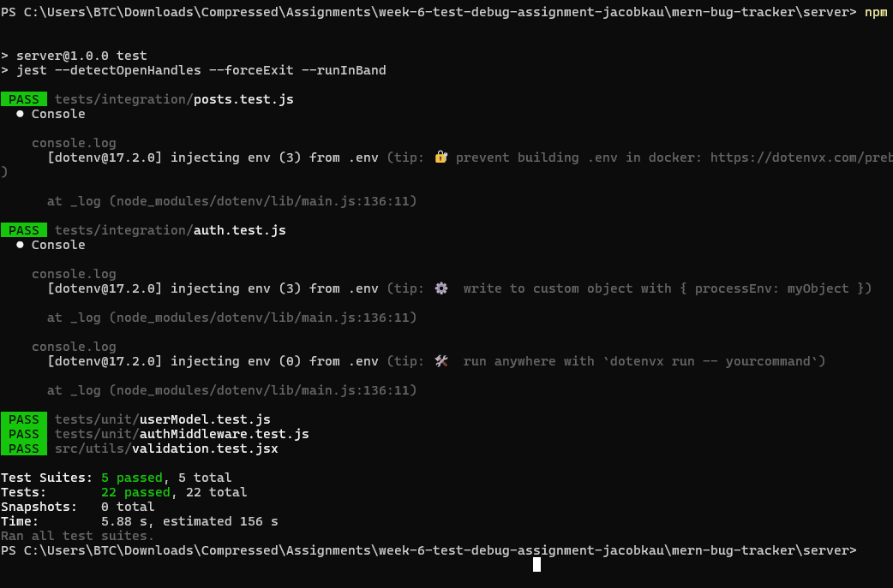
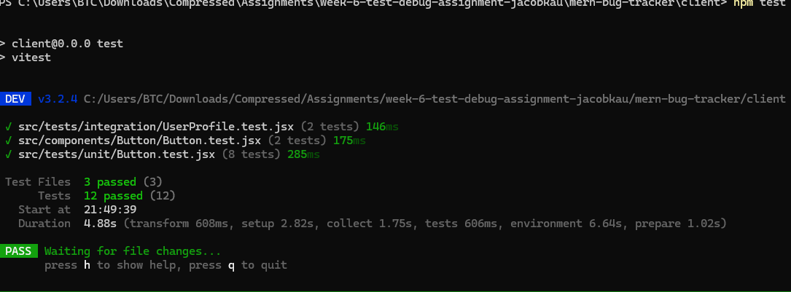

# MERN BUG TRACKER   

## 📝 Project Overview
This project implements comprehensive testing strategies for a MERN (MongoDB, Express, React, Node.js) stack application, including unit testing, integration testing, and end-to-end testing. The project also incorporates various debugging techniques to ensure application reliability.

## 🎯 Objective
The primary goal is to ensure application reliability through:
- Comprehensive test coverage (unit, integration, e2e)
- Effective debugging techniques
- Performance monitoring
- Error handling strategies

## 📂 Project Structure

### Client Directory
```
mem-bug-tracker/
├── client/
│   ├── cypress/                # End-to-end tests
│   │   ├── e2e/
│   │   │   └── auth.cy.js      # Authentication tests
│   │   └── cypress.config.js   # Cypress configuration
│   ├── public/
│   ├── src/
│   │   ├── assets/             # Static assets
│   │   ├── components/         # React components
│   │   │   ├── Button/
│   │   │   ├── ErrorBoundary.jpx  # Error boundary component
│   │   │   └── UserProfile.jpx    # User profile component
│   │   ├── mocks/              # Mock data and handlers
│   │   ├── tests/              # Test files
│   │   │   ├── integration/    # Integration tests
│   │   │   └── unit/           # Unit tests
│   │   ├── App.css             # Main styles
│   │   ├── App.jsx             # Main App component
│   │   ├── app.text.js         # App tests
│   │   ├── main.jsx            # Application entry point
│   │   └── setupTests.js       # Test setup configuration
│   ├── .gitignore
│   ├── eslint.config.js        # ESLint configuration
│   ├── index.html
│   ├── jest.setup.js           # Jest setup
│   ├── package-lock.json
│   ├── package.json
│   ├── README.md
│   ├── vite.config.js          # Vite configuration
│   └── vitest.config.js        # Vitest configuration
```

### Server Directory
```
server/
├── config/                     # Configuration files
│   ├── config.js               # Main configuration
│   └── db.js                   # Database configuration
├── src/
│   ├── middleware/             # Express middleware
│   │   ├── auth.js             # Authentication middleware
│   │   ├── config.js
│   │   └── errorHandler.js     # Error handling middleware
│   ├── models/                 # Database models
│   │   ├── post.js             # Post model
│   │   └── user.js             # User model
│   ├── routes/                 # API routes
│   │   ├── authRoutes.js       # Authentication routes
│   │   └── postRoutes.js       # Post routes
│   ├── utils/                  # Utility functions
│   │   ├── auth.js             # Auth utilities
│   │   ├── config.js
│   │   ├── validation.js       # Validation utilities
│   │   └── validation.test.jsx # Validation tests
│   ├── app.js                  # Express application
│   └── tests/                  # Test files
│       ├── integration/        # Integration tests
│       └── unit/               # Unit tests
├── .env                        # Environment variables
├── jest.config.js              # Jest configuration
├── package-lock.json
├── package.json
├── README.md
├── server.js                   # Server entry point
└── Week6-Assignment.md         # Assignment details
```

## 🛠️ Setup Instructions

1. **Clone the repository**:
   ```bash
   git clone <repository-url>
   ```

2. **Install dependencies**:
   ```bash
   # From the root directory
   npm run install-all
   ```

3. **Set up the test database**:
   ```bash
   # In the server directory
   npm run setup-test-db
   ```

4. **Configure environment variables**:
   - Create a `.env` file in the server directory based on `.env.example`

## 🧪 Testing Commands

### Run all tests
```bash
npm test
```

### Run specific test types
```bash
# Unit tests
npm run test:unit

# Integration tests
npm run test:integration

# End-to-end tests
npm run test:e2e
```

### Test coverage
```bash
# Generate coverage report
npm run test:coverage
```

## 📋 Testing Strategy

### 1. Unit Testing
- **Client**: React components, custom hooks, utility functions
- **Server**: Middleware, utility functions, model methods
- **Coverage Goal**: Minimum 70% coverage for critical paths

### 2. Integration Testing
- API endpoint testing with Supertest
- Database operation testing with test database
- Component integration with API calls
- Authentication flow testing

### 3. End-to-End Testing
- Critical user flows (registration, login, CRUD operations)
- Navigation and routing
- Error handling and edge cases
- Visual regression testing

## 🐛 Debugging Techniques Implemented
1. **Server-side**:
   - Comprehensive logging strategy
   - Global error handler middleware
   - Performance monitoring

2. **Client-side**:
   - React Error Boundaries
   - Debug logging
   - Browser developer tools integration

## ✅ Expected Outcomes
- Comprehensive test suite covering all critical paths
- High code coverage reports
- Improved application reliability
- Well-documented debugging procedures

## 📄 Documentation
- Test coverage reports available in `/coverage` after running tests
- Debugging procedures documented in code comments
- Testing strategy documented in this README

## 📷 Screenshots
- Test coverage reports (see attached `client-test.png` and `image.png`)

 


- Example test runs
